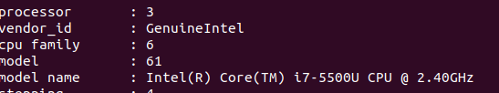
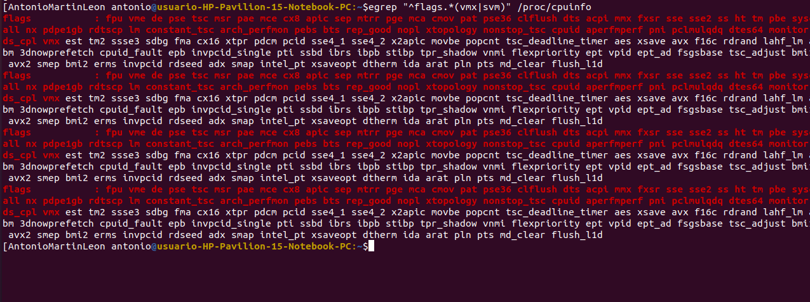

# Ejercicios autoevaluacion tema 1

## Ejercicio 1. Consultar en el catálogo de alguna tienda de informática el precio de un ordenador tipo servidor y calcular su coste de amortización a cuatro y siete años. [Consultar este artículo en Infoautónomos sobre el tema](https://www.infoautonomos.com/consultas-a-la-comunidad/988/)

El ordenador tipo servidor que he elegido es el siguiente HPE ProLiant ML30 Gen10 Intel Xeon E-2224/8GB para más informacion sobre el pincha [aquí](https://www.pccomponentes.com/hpe-proliant-ml30-gen10-intel-xeon-e-2224-8gb), con un precio actual de 807.
Según el artículo en infoautónomos proporcionado en los apuntes, el coeficiente de amortización para 4 años es del 25%, por lo que 0.25x807=201,75 es el coste de amortización por año.
En el caso de 7 años es del 14,29%, por lo que 0.1429x807=115,3203 es el coste de amortización por año.

## Ejercicio 2. Usando las tablas de precios de servicios de alojamiento en Internet “clásicos”, es decir, que ofrezcan Virtual Private Servers o servidores físicos, y de proveedores de servicios en la nube, comparar el coste durante un año de un ordenador con un procesador estándar (escogerlo de forma que sea el mismo tipo de procesador en los dos vendedores) y con el resto de las características similares (tamaño de disco duro equivalente a transferencia de disco duro) en el caso de que la infraestructura comprada se usa solo el 1% o el 10% del tiempo.

Para elegir el VPS, he buscado en esta [página](https://www.arsys.es/servidores/vps), y he optado por elegir el VP2.
Este VPS proporciona lo siguiente:
- Procesador 2 vCPU Intel Xeon
- Memoria RAM 4 GB
- Almacenamiento 60 GB SSD
- Transferencia ilimitada
- 1 IP y firewall incluidos
- Con un precio de 7.50€/mes.

Por otro lado, para servicios en la nube he elegido [este](https://www.ionos.es/server-configurator?__sendingdata=1&cart.action=add-bundle&cart.bundle=tariff-ngcs-unlimited-fix-m-bundle&packageselection=cloud%2Fservidores-cloud), ya que tienes unas característica similares. Este nos ofrece lo siguiente:
- 60GB de disco duro
- 2GB de memoria RAM 
- 2 vCore CPU. 
- El precio es de 0,0222 euros la hora que son 16€/mes.

Ahora, con VPS nos vemos con la obligacion de la mensualidad entera aunque no lo usemos, por este motivo el precio anual sería de 90€. En el caso del servicio cloud, si lo usamos solo el 20% del día serían 4,8 horas, por lo que 0,0222x4,8=0,1066€/dia lo que equivale, 3,3046€/mes y 39,6552€/año. 

Por conclusión, el VPS pageremos 189€/año y por el servicio cloud 39,6552€/año. Por esto podemos comprobar que la diferencia es muy amplia si tenemos en cuenta el tiempo de uso que le vamos a dar.

## Ejercicio 3. En general, cualquier ordenador con menos de 5 o 6 años tendrá estos flags. ¿Qué modelo de procesador es? ¿Qué aparece como salida de esa orden? Si usas una máquina virtual, ¿qué resultado da? ¿Y en una Raspberry Pi o, si tienes acceso, el procesador del móvil?
El procesador es el siguiente:

La salida de la orden es:

## Ejercicio 4. Instalar un hipervisor para gestionar máquinas virtuales, que más adelante se podrá usar en pruebas y ejercicios. Usar siempre que sea posible un hipervisor que sea software libre.

He elegido el famoso VirtualBox, una prueba de que esta instalado es esta imagen:
