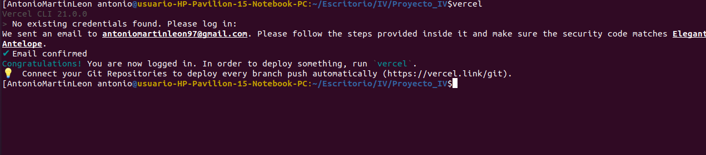
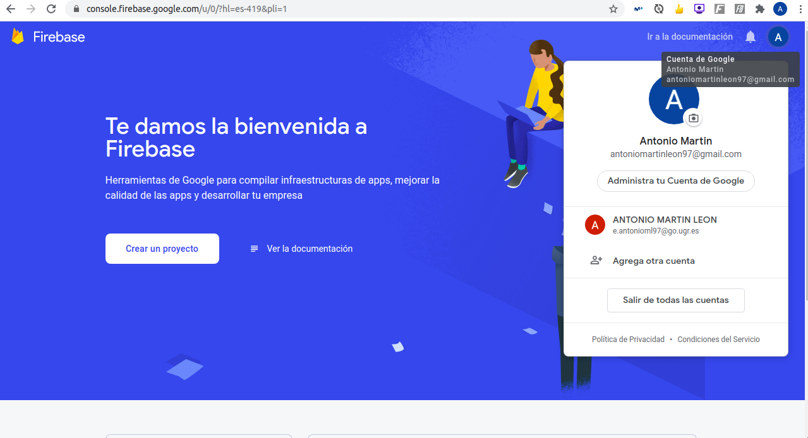
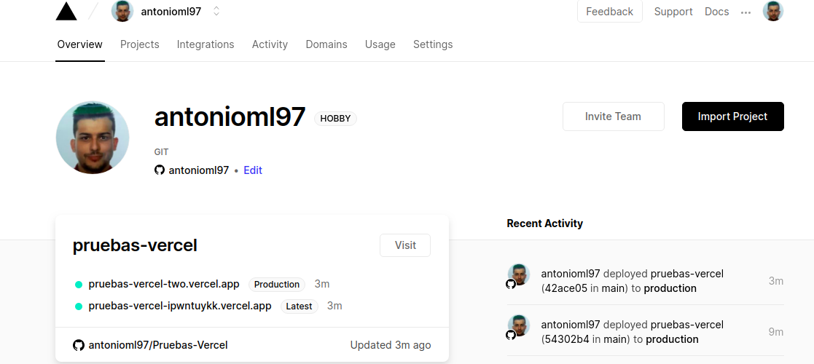
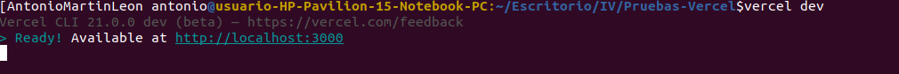
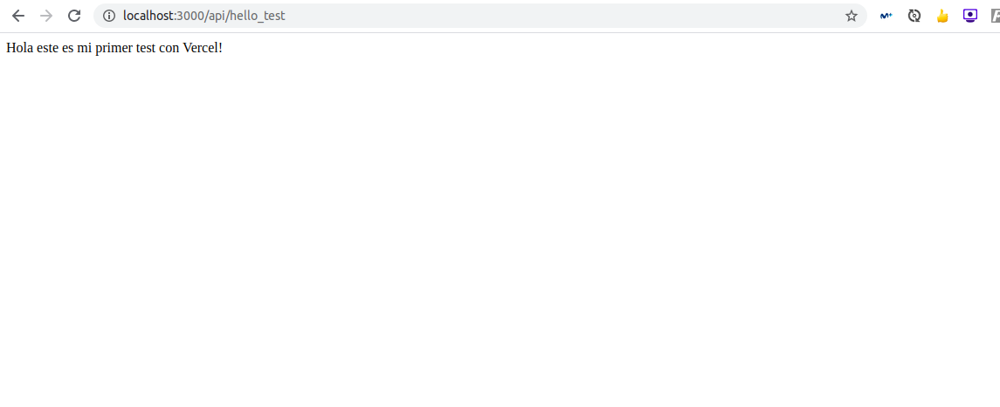
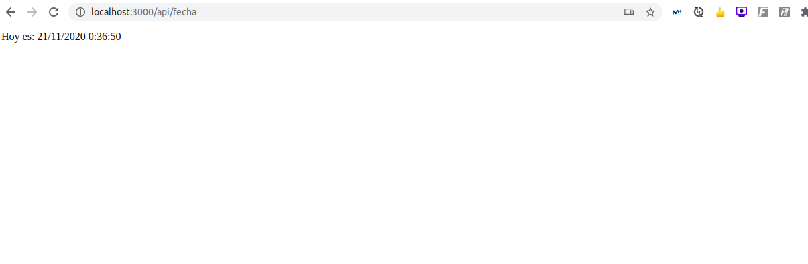
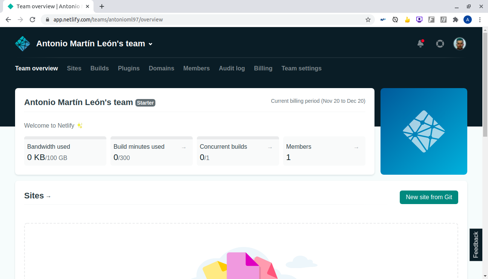
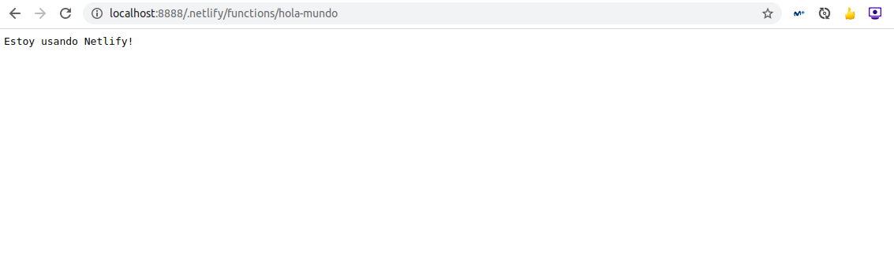
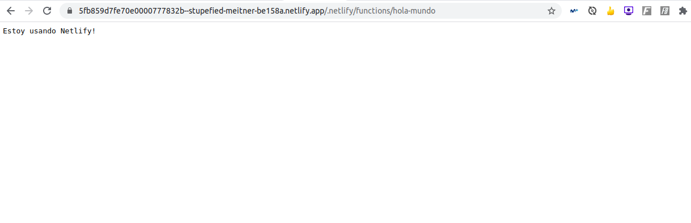

# Ejercicio 1. Darse de alta en Vercel y Firebase, y descargarse los SDKs para poder trabajar con ellos localmente

## Vercel
Para trabajar en local, nos deberemos descargar el CLI, he ejecutado ```npm i -g vercel``` como pone en su documentación.

## Firebase
El CLI lo instalamos con ```npm install -g firebase-tools```, y para trabajar en local, es necesario instalar firebase-admin y firebase-functions. 
```npm install -g firebase-admin```
```npm install -g firebase-functions```


# Ejercicio 2. Tomar alguna de las funciones de prueba de Vercel, y hacer despliegues de prueba con el mismo.

Lo primero que he hecho ha sido crear un repositorio para hacer estos despliegues simples, llamado [Pruebas-Vercel](https://github.com/antonioml97/Pruebas-Vercel).

Una vez hecho esto, he añadido solo este repositorio a Vercel.


Hemos hecho 2 pruebas básicas, uno que muestra el tipico Hello World, pero con un mensaje algo distinto y otra para indiciar el dia que es. Lo primero que tenemos que hacer lanzarlo asi:



Tras esto, lanzar los test es tan simple como esto:



# Ejercicio 3. Tomar alguna de las funciones de prueba de Netlify, y hacer despliegues de prueba con el mismo
Lo primero que tenemos que hacer es registrarnos en la plataforma.


En esta ocasion, vuelvo a hacer una especie de "Hola mundo", tanto en local como con la url que te da Netlify.



