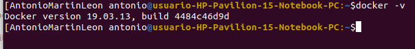
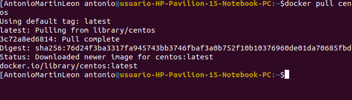
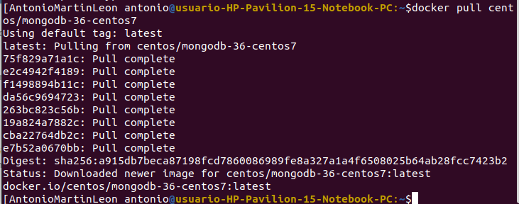
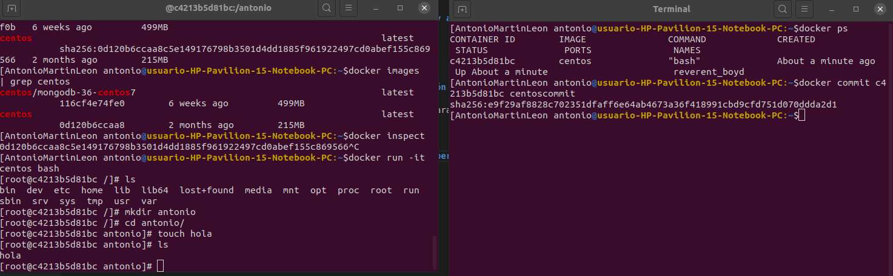

## Ejercicio 1 Instalar docker y/o otro gestor de contenedores como Podman/Buildah

## Ejercicio 2
### Instalar a partir de docker una imagen alternativa de Ubuntu y alguna adicional, por ejemplo de CentOS

### Buscar e instalar una imagen que incluya MongoDB.
Esta imagen es centos/mongodb-36-centos7

## Ejercicio 3 Crear un usuario propio e instalar alguna aplicación tal como nginx en el contenedor creado de esta forma, usando las órdenes propias del sistema operativo con el que se haya inicializado el contenedor.
Primero ejecutamos el comando docker run -i -t centos /bin/bash para abrir una terminal, creamos un usuario y lo instalamos con la orden yum install nginx

## Ejercicio 4 Crear a partir del contenedor anterior una imagen persistente con commit.
Para llevar acabo este ejercicio he visto este [video](https://www.youtube.com/watch?v=3AIR4JL8PmA)

## Ejercicio 5 y 6
Hecho en el hito.