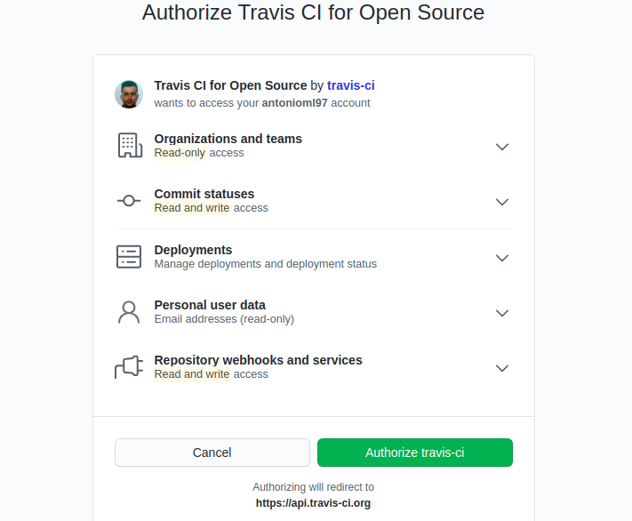

# Inicios con Travis - Ejercicio 9

## Darse de alta. Muchos están conectados con GitHub por lo que puedes autentificarte directamente desde ahí. A través de un proceso de autorización, puedes acceder al contenido e incluso informar del resultado de los tests a GitHub

En mi caso lo hecho a traves de GitHub.

## Activar el repositorio en el que se vaya a aplicar la integración continua. Travis permite hacerlo directamente desde tu configuración; en otros se dan de alta desde la web de GitHub.

Para ello nos vamos a Setting y seleccionamos el repositrio que queremos.

## Crear un fichero de configuración para que se ejecute la integración y añadirlo al repositorio.
Este fichero es [.travis.yml](https://github.com/antonioml97/BuscadorPartidos/blob/master/.travis.yml) que debe de estar en nuetro repositorio.

# Configurar integración continua para nuestra aplicación usando Travis o algún otro sitio. - Ejercicio 10
Una vez hecho todo lo anterior he adaptado el .travis.yml para que trabaje directamente con el contenedor que hicimos en el hito anterior.
Dando este resultado:

